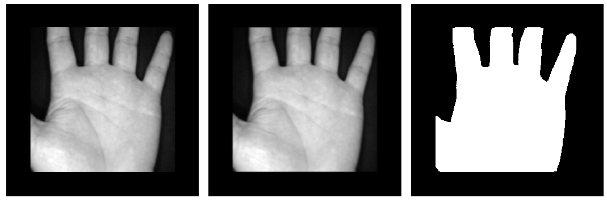
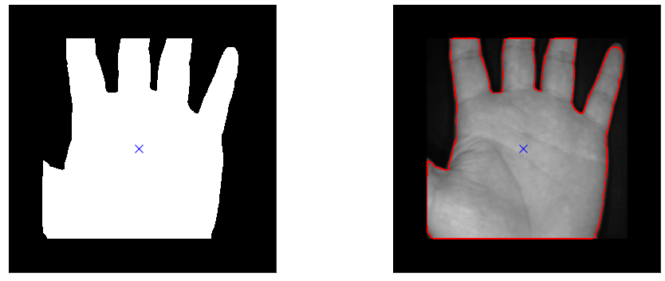
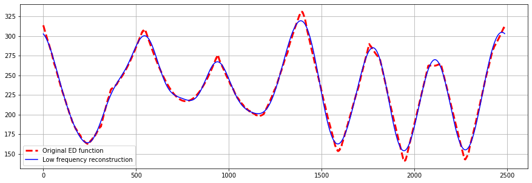
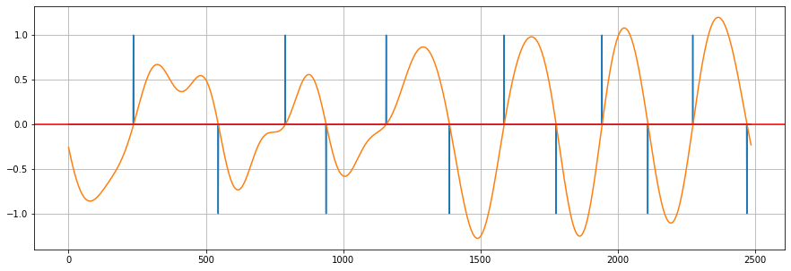
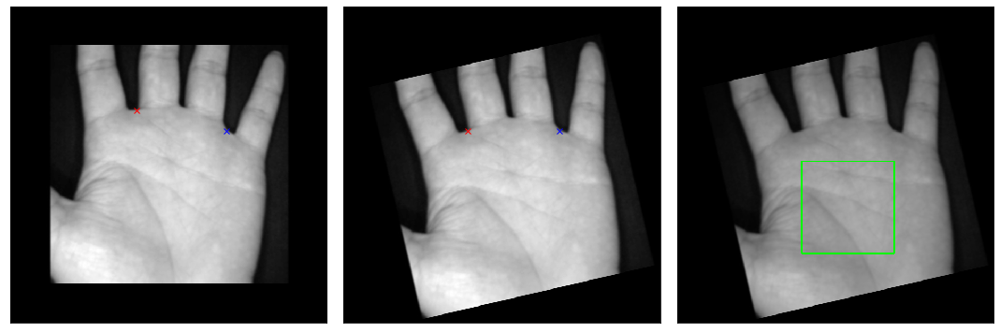
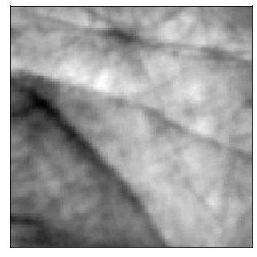

# Effectual-Palm-RoI-Extraction

Python implementation of the Palmprint RoI extraction algorithm from [An Effectual Method for Extraction of ROI of Palmprints](https://ieeexplore.ieee.org/stamp/stamp.jsp?tp=&arnumber=6398207&tag=1)

## Algorithm
- Image is blurred and mask is extracted using Otsu Binarization.

<div align='center'>
   
</div>

- Centorid of mask is calcualted using moments M_10 and M_01 of the image.

- Edges are extracted by subtracting the erosion of the mask from itself. A 3x3 + shaped kernel is used for erosion.

- Outer boundary is detected using simple 8 connectivity.

<div align='center'>
   
</div>

- Find distance of points on the boundary from the centroid.

- Remove high frequency components from the function so that minimas due to unevenness of edge are removed

<div align='center'>
   
</div>

- Differentiate and find valley points from local minimas.

<div align='center'>
   
</div>

- Rotate the image to align valley points horizontally and crop the Region of Interest.

<div align='center'>
   
   
</div>

## Requirements
```
Numpy
OpenCV
Matplotlib
```
